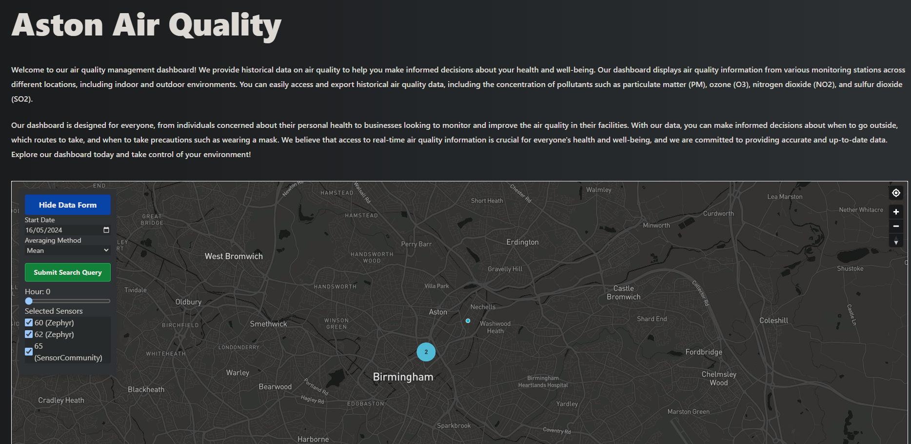

<a name="readme-top"></a>

<!-- PROJECT SHIELDS -->
[![Deployment][passing-deployment-badge]][project-url]
![Tests][passing-tests-badge]


<!-- PROJECT LOGO -->
<br />
<div align="center">
  <a href="https://github.com/AstonAirQuality/AirQuality_Frontend">
    
  </a>

<h3 align="center">AstonAirQuality API</h3>
  
  

  <p align="center">
    A Frontend React web app that serves as a management portal for Aston University's air quality sensor fleet. This project is part of a full stack web application designed for automated data ingestion from low-cost air quality sensors. It allows CRUD operations on sensor platforms and viewing of sensor data in an interactive map.
    <br />
    <a href="https://github.com/AstonAirQuality/AirQuality_Frontend"><strong>Explore the docs »</strong></a>
    <br />
    <br />
    <a href="https://github.com/AstonAirQuality/AirQuality_Frontend">View Demo</a>
    ·
    <a href="https://github.com/AstonAirQuality/AirQuality_Frontend/issues">Report Bug</a>
    ·
    <a href="https://github.com/AstonAirQuality/AirQuality_Frontend/issues">Request Feature</a>
  </p>
</div>

<!-- TABLE OF CONTENTS -->
<details>
  <summary>Table of Contents</summary>
  <ol>
    <li>
      <a href="#about-the-project">About The Project</a>
      <ul>
        <li><a href="#built-with">Built With</a></li>
      </ul>
    </li>
    <li>
      <a href="#getting-started">Getting Started</a>
      <ul>
        <li><a href="#prerequisites">Prerequisites</a></li>
        <li><a href="#installation">Installation</a></li>
      </ul>
    </li>
    <li><a href="#contact">Contact</a></li>
  </ol>
</details>

<!-- ABOUT THE PROJECT -->
## About The Project

<a href="https://github.com/AstonAirQuality/AirQuality-API">
    
</a>

<p>
A Frontend React web application serving as a management interface for Aston University's air quality sensor fleet. This project is part of a comprehensive full stack web application, designed for automatic data intake from budget-friendly air quality sensors. It facilitates a GUI platform for creating, reading, updating, and deleting sensor platforms, scheduling data ingestion tasks, and reviewing intake logs and sensor data on an interactive map.
</p>
<p align="right">(<a href="#readme-top">back to top</a>)</p>


### Built With
* [![React][react-badge]](https://reactjs.org/)
* [![Firebase][firebase-badge]](https://firebase.google.com/)
* [![TailwindCSS][tailwind-badge]](https://tailwindcss.com/)
* [![Mapbox][mapbox-badge]](https://www.mapbox.com/)

<!-- GETTING STARTED -->
## Getting Started

To get a local copy up and running follow these simple steps.

### Prerequisites

Node.js and npm are required to run this project. You can download them from the [official website](https://nodejs.org/en/).

Furthermore, you will need to have a Firebase project set up and configured. You can create a new [Firebase project](https://firebase.google.com/).

A Mapbox account is also required to use the map features. You can create a [new Mapbox account](https://account.mapbox.com/).

And finally you will need a docker container running the backend API. You can find the [backend API repository](https://github.com/AstonAirQuality/AirQuality-API)


### Installation

1. Clone the repo
   ```sh
   git clone AstonAirQuality/AirQuality_Frontend
   ```
2. Install NPM packages
   ```sh
    npm install
    ```
3. Copy the `env-template.txt` file and rename it to `.env` and fill in the required fields.
   ```sh
   cp env.example .env
   ```
4. Run the project
   ```sh
    npm start
    ```
5. The project should now be running on `localhost:3000`

<!-- CONTACT -->
## Contact

Twitter (X): [@dev_riyad](https://twitter.com/dev_riyad) 
<br/>
Email: riyad23008@gmail.com
<br/>
Project Link: [https://github.com/AstonAirQuality/AirQuality-Frontend](https://github.com/AstonAirQuality/AirQuality-Frontend)
<p align="right">(<a href="#readme-top">back to top</a>)</p>


<!-- MARKDOWN LINKS & IMAGES -->
[project-url]: https://aston-air-quality.web.app/
[passing-deployment-badge]: https://img.shields.io/badge/deployment-success-green
[passing-tests-badge]: https://img.shields.io/badge/tests-success-green
[react-badge]: https://img.shields.io/badge/React-black?logo=react
[firebase-badge]: https://img.shields.io/badge/Firebase-d42a2a?logo=firebase
[tailwind-badge]: https://img.shields.io/badge/TailwindCSS-2a46d4?logo=tailwindcss
[mapbox-badge]: https://img.shields.io/badge/Mapbox-4b4b4b?logo=mapbox